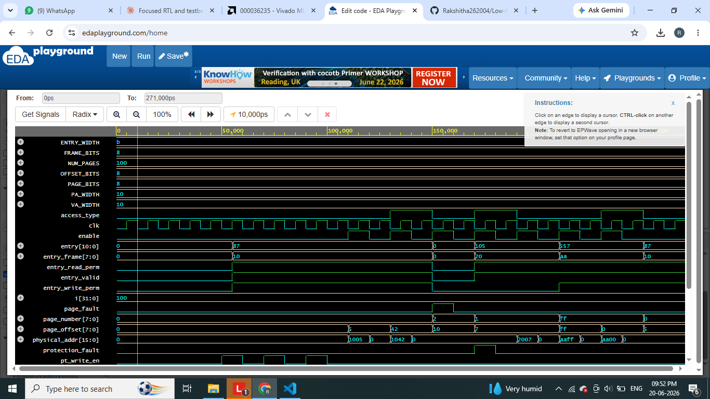
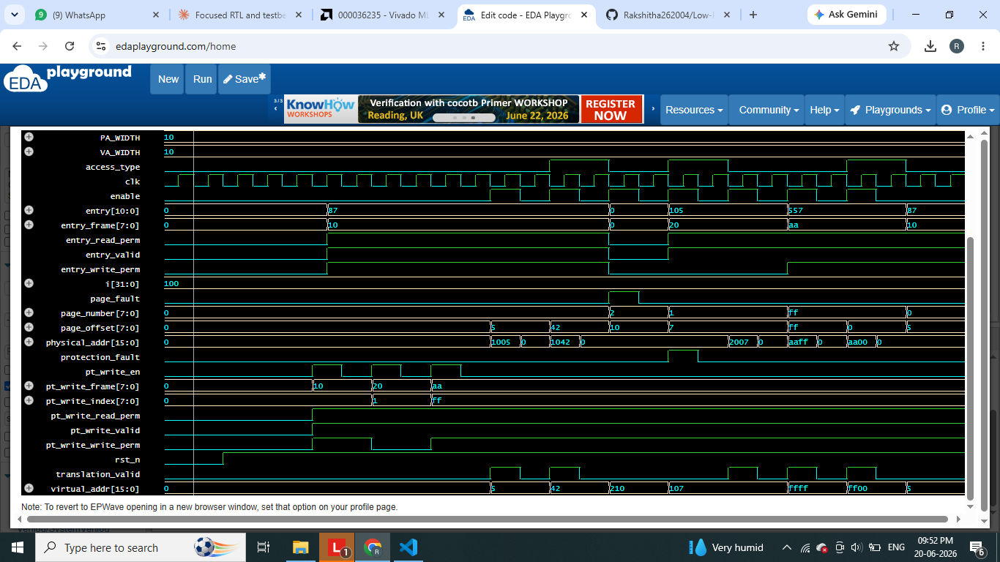

# Memory Management Unit (MMU) Design using Verilog HDL

A synthesizable Verilog RTL implementation of a Memory Management Unit that performs virtual-to-physical address translation, page table lookup, valid-bit checking, and read/write permission enforcement — the same core mechanism used inside real CPUs to support virtual memory and OS-level memory protection.

---

## Overview

This project implements an MMU that:
- Accepts a 16-bit virtual address and splits it into a page number and page offset
- Looks up a 256-entry page table to find the corresponding physical frame
- Checks a **valid bit** to detect unmapped pages (page fault)
- Checks **read/write permission bits** to detect illegal accesses (protection fault)
- Outputs a 16-bit physical address and fault status flags

It is built to be simulation-provable without requiring physical FPGA hardware, while still including a complete FPGA implementation path (constraints file + synthesis steps) for anyone who wants to deploy it on a board.

## Problem Statement

Modern processors run multiple programs that each assume they have access to the full address space. Without translation and protection hardware, one process could read or corrupt another process's memory. The MMU solves this by transparently mapping each process's virtual addresses to real physical memory locations and denying any access that violates page validity or permission rules.

## VLSI / Computer Architecture Concepts Used

| Concept | Role in this project |
|---|---|
| Virtual Address | Address generated by a program (not the real memory location) |
| Physical Address | Real address in physical memory |
| Page Number | Upper bits of VA, used to index the page table |
| Page Offset | Lower bits of VA, passed through unchanged |
| Page Table | Storage mapping page numbers to frame numbers + flags |
| Frame Number | Physical memory block a page maps to |
| Valid Bit | Marks whether a page is currently mapped |
| Read/Write Permission Bits | Enforce access control per page |
| Page Fault | Signal raised when a page is not valid |
| Protection Fault | Signal raised when an operation violates permissions |
| Combinational Logic | Address translation and fault-checking logic |
| Sequential Logic | Page table memory, written synchronously on reset/programming |

## Architecture

```
Virtual Address (16-bit)
        │
        ├── [15:8] Page Number ──────► Page Table Lookup (256 entries)
        │                                       │
        └── [7:0]  Offset ──────────┐           ▼
                                     │     ┌─────────────┐
                                     │     │ Valid Bit?  │── No ──► PAGE FAULT
                                     │     └─────────────┘
                                     │           │ Yes
                                     │           ▼
                                     │     ┌─────────────────┐
                                     │     │ Permission OK?  │── No ──► PROTECTION FAULT
                                     │     └─────────────────┘
                                     │           │ Yes
                                     │           ▼
                                     │     Frame Number (8-bit)
                                     │           │
                                     └───────────┴──► Physical Address (Frame || Offset)
```

### Address Format

| Field | Width | Bits |
|---|---|---|
| Virtual Address | 16 bits | Page Number [15:8], Offset [7:0] |
| Physical Address | 16 bits | Frame Number [15:8], Offset [7:0] |
| Page Size | 256 bytes | (8-bit offset) |
| Page Table Entries | 256 | (8-bit page number → 2^8) |

### Page Table Entry Format (11 bits per entry)

| Bits | Field | Meaning |
|---|---|---|
| [10:3] | Frame Number | Physical frame this page maps to |
| [2] | Valid Bit | 1 = page present, 0 = page fault |
| [1] | Write Permission | 1 = write allowed |
| [0] | Read Permission | 1 = read allowed |

### Output Signals

| Signal | Width | Meaning |
|---|---|---|
| `physical_addr` | 16-bit | Translated address (valid only when `translation_valid = 1`) |
| `page_fault` | 1-bit | Page not present in page table |
| `protection_fault` | 1-bit | Access type not permitted on this page |
| `translation_valid` | 1-bit | Translation succeeded |

## Tools Used

- **Verilog HDL** (IEEE 1364), fully synthesizable, no SystemVerilog dependency
- **Icarus Verilog (iverilog/vvp)** — open-source simulator used to verify this design
- **GTKWave** — for waveform viewing (or Vivado/ModelSim waveform viewers)
- **Xilinx Vivado** — for synthesis and optional FPGA deployment

## Folder Structure

```
MMU-Design-Verilog-HDL/
├── rtl/                 # Synthesizable RTL source (mmu.v)
├── tb/                  # Testbench (mmu_tb.v)
├── constraints/          # FPGA pin constraints (.xdc)
├── simulation/           # Simulation logs
├── waveforms/             # VCD waveform dumps
├── reports/               # Synthesis / utilization reports
├── images/                 # Screenshots for proof-of-work
├── docs/                   # Project report and notes
├── README.md
└── .gitignore
```

## How to Simulate

### Option 1 — Icarus Verilog (local, free, used to verify this repo)
```bash
iverilog -o sim_out rtl/mmu.v tb/mmu_tb.v
vvp sim_out
gtkwave waveforms/mmu_waveform.vcd
```

### Option 2 — EDA Playground (no install required)
1. Go to https://www.edaplayground.com
2. Create a new project, select **Icarus Verilog 12** as the simulator
3. Paste `rtl/mmu.v` into the Design file pane
4. Paste `tb/mmu_tb.v` into the Testbench file pane
5. Click **Run** — check the console for `ALL 8 TESTS PASSED`
6. Open EPWave to view the waveform

### Option 3 — Xilinx Vivado
1. Create a new RTL project
2. Add `rtl/mmu.v` as a design source
3. Add `tb/mmu_tb.v` as a simulation source
4. Run Behavioral Simulation
5. Inspect the waveform in the Vivado waveform viewer

## Verified Simulation Result

This testbench was run against the RTL using Icarus Verilog and **all 8 tests passed**:

```
[PASS] Test 1 (Valid_Read_Page0)
[PASS] Test 2 (Valid_Write_Page0)
[PASS] Test 3 (PageFault_Page2)
[PASS] Test 4 (ProtectionFault_WriteOnReadOnly)
[PASS] Test 5 (Valid_Read_ReadOnlyPage1)
[PASS] Test 6 (Boundary_MaxPage_MaxOffset)
[PASS] Test 7 (Boundary_MaxPage_ZeroOffset)
[PASS] Test 8 (Disabled_Enable)
-----------------------------------------------------
ALL 8 TESTS PASSED
-----------------------------------------------------
```

See `simulation/simulation_log.txt` for the full log and `waveforms/mmu_waveform.vcd` for the waveform dump.

## FPGA Implementation (Optional)

Hardware is not required to prove this project — simulation results, waveforms, and synthesis reports are sufficient evidence of a working design. For anyone with access to a Xilinx board:

1. Create a Vivado project and add `rtl/mmu.v`
2. Add `constraints/mmu_constraints.xdc` (update pin LOCs to match your board)
3. Run **Synthesis** → review utilization report
4. Run **Implementation** → review timing report
5. Generate **Bitstream** and program the board
6. Use switches for virtual address / access type, observe physical address and fault flags on LEDs

## Screenshot
|waveforms|simulation|
|---------|----------|
|||
|||

## Future Improvements

- Add a Translation Lookaside Buffer (TLB) for caching recent translations
- Support multi-level page tables for larger address spaces
- Add page-fault handling state machine with a software-style fault handler
- Extend to support execute permission (NX bit) and supervisor/user mode

## Learning Outcomes

- Practical understanding of virtual memory and address translation as implemented in hardware
- RTL design of memory-mapped table structures and combinational decision logic
- Writing self-checking Verilog testbenches with task-based reusable test sequences
- End-to-end VLSI workflow: RTL → simulation → waveform verification → synthesis → FPGA constraints

---

**Author:** Rakshitha A S (1AH23CY042) — B.E. Cybersecurity
